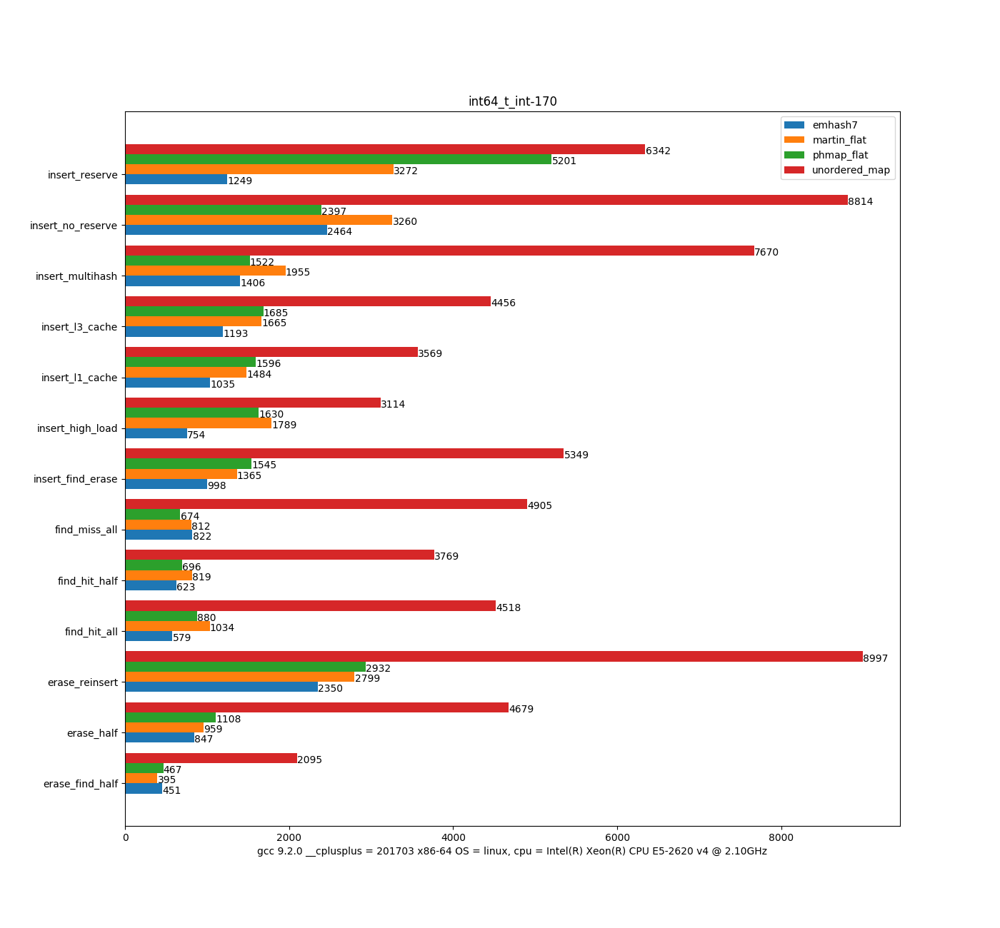
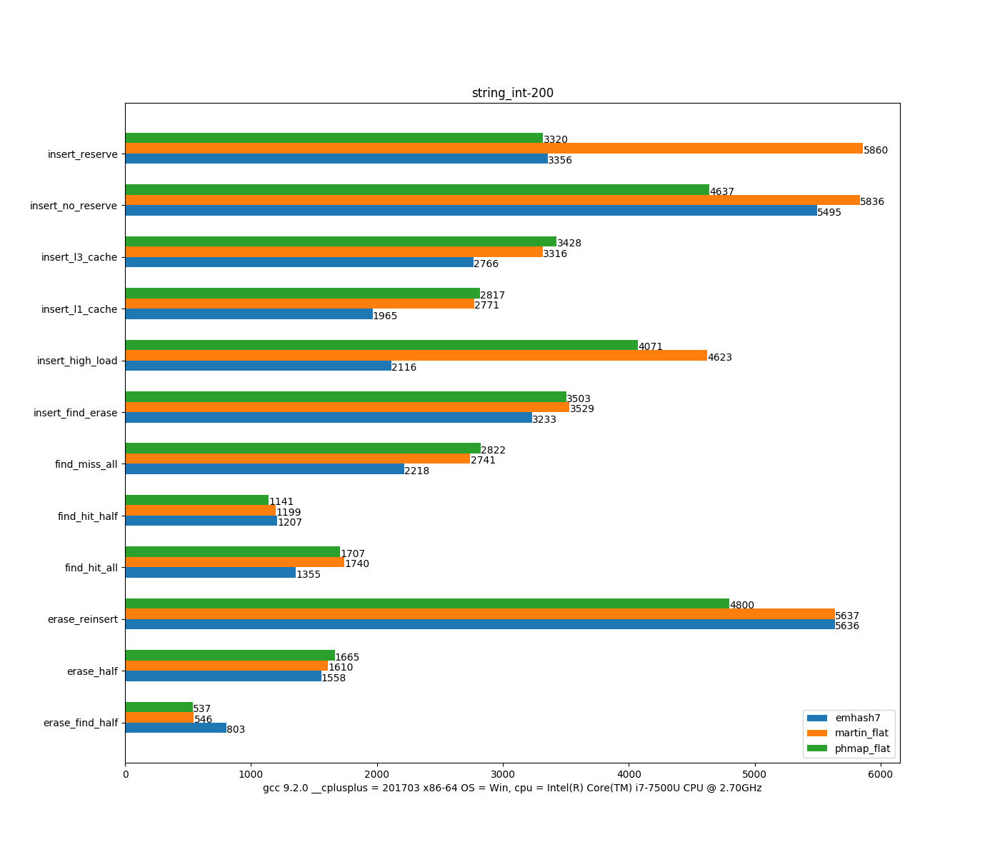

# emhash feature

A quite fast and memory efficient *open address c++ flat hash map*, it is easy to be benched/tested/compared with other's hash map.

    some feature is not enabled by default and it also can be used by set the compile marco but may loss tiny performance, some featue is conflicted each other or difficlut to be merged into only one head file and so it's distributed in different hash table file. Not all feature can be open in only one file(one hash map).

- default load factor is 0.95 and can be set to **0.999** by enable compile marco *EMHASH_HIGH_LOAD* (in hash_table6/7.hpp)

- **head only** support by c++0x/11/14/17 without any depency, interface is highly compatible with std::unordered_map,some new function is added for performance issiue.
    - _erase :  without return next iterator after erasion
    - shrink_to_fit : shrink memory to fit for saving memory
    - insert_unqiue : insert unique key into hash without find and compare
    - try_find : check or get key/value without return iterator
    - set_get : only once find/insert combind.

- more **efficient** than other's hash map implemention if key&value is some aligned (ex sizeof(key) % 8 != sizeof(value) % 8),  hash_map<uint64_t, uint32_t> can save 1/3 memoery than hash_map<uint64_t, uint64_t>.

- **lru** can be used if compile marco EMHASH_LRU_SET set for some special case. for exmaple some key is "frequceny accessed", if the key accessed is not in **main bucket** position, it'll be swaped with main bucket from current position, and it will be founded/probed only once during next access.

- **no tombstones** in this hash map. performance will **not deteriorate** even high frequceny insertion and erasion.
    
- more than **5 different** implementation to choose, each of them is some tiny different can be used in some case
for example some case pay attention on finding hot, some focus on finding cold(miss), and others only care about insert or erase and so on.

- it's the **fastest** hash map for find performance(100% hit) at present, and fast inserting performacne if no rehash (**reserve before insertsion**) and effficient erasion. At present from 6 different benchmark(4 of them in my bench dir) by my bench

- It's fully tested on OS(Win, Linux, Mac) with compiler(msvs, clang, gcc) and cpu(AMD, Intel).

- many optimization with *integer* key, some new and interesting feature is underdeveloping if it's stable to release.

# emhash design

- only *one array* allocted, each node/bucket contains a struct (keyT key, int bucket, ValueT value), bucket is not awalys in the middle between key and value, depend on struct align pack.

- a simple and smart **collision algorithm** used for hash collision, collision bucket is linked after the main bucket with a auxiliary integer index(bucket). main bucket can not be occupyed and all opertion starts from it. 

- **three different ways** of probe is used to seach the empty bucket from array. it's not suffered heavily performance loss by primary and secondary clustering.
   - linear probing search the first cpu cacheline
   - quadratic probing start work after limited linear probing
   - random probing used with a very bad hash

- use the **second/backup hashing function** if the input hash is bad with a very high collision if the compile marco *EMHASH_SAFE_HASH* is set to defend hash attack(average 10% performance descrease)

- dump hash **collision statics** to analyze cache performance, number of probes for look up of successful/unsuccessful can be showed from dump info.
 
- A new cache friendly algorithm of finding multi empty bucket base on cpu bit scanf(ctz) instruction(x86). it filters *64* bucket at once than other's implemention.
 
- choose *different* hash algorithm by set compile marco *EMHASH_FIBONACCI_HASH* or *EMHASH_IDENTITY_HASH* depend on use case.

- the thirdy party string hash algorithm is used for string key [wyhash](https://github.com/wangyi-fudan/wyhash), which is 3 times faster than std::hash string implementation 

### benchmark

some of benchmark result is uploaded, I use other hash map (martinus, ska, phmap, dense_hash_map) source to compile and benchmark.
[] and []

another html result with impressive curve [chartsAll.html](https://github.com/ktprime/emhash/blob/master/bench/tsl_bench/chartsAll.html) 
(download all js file in tls_bench dir)
generated by [Tessil](https://tessil.github.io/2016/08/29/benchmark-hopscotch-map.html) benchmark code

txt file result [martin_bench.txt](https://github.com/ktprime/emhash/blob/master/bench/martin_bench.txt) generated by code from
[martin](https://github.com/martinus/map_benchmark)

the benchmark code is some tiny changed for injecting new hash map, the result is not final beacuse it depends on os, cpu, compiler and dataset input.

my ebench result: low is best





# some bad
- it's not a node-based hash map and can't keep the reference stable if insert/erase/rehash happens, use value pointer or choose the other node base hash map.
```
    emhash7:HashMap<int,int> myhash(10);
    myhash[1] = 1;
    auto& myref = myhash[1];//**wrong used here**,  can not keep reference stable
     ....
    auto old = myref ;  // myref maybe be changed and not invalid.
       
    emhash7:HashMap<int,int> myhash2;
    for (int i = 0; i < 10000; i ++)
        myhash2[rand()] = myhash2[rand()]; // it will be crashed because of rehash, call reserve before or use insert.
 ```

- for very large key-value, use pointer instead of value if you care about memory usage with high frequency of insertion or erasion
```  
  emhash7:HashMap<keyT,valueT> myhash; //value is very big, ex sizeof(value) 100 byte

  emhash7:HashMap<keyT,*valueT> myhash2; //new valueT, or use std::shared_ptr<valueT>.
  
```

- the only known bug as follow example, if erase key/iterator during iteration. one key will be iteraored twice or missed. and fix it can desearse performance 20% or even much more and no good way to fix.

```
    emhash7:HashMap<int,int> myhash;
    //dome some init ...
    for (const auto& it : myhash)
    {
        if (some_key = it.first) {
            myhash.erase(key);  //no any break
       }
       ...
       do_some_more();
    }
```

