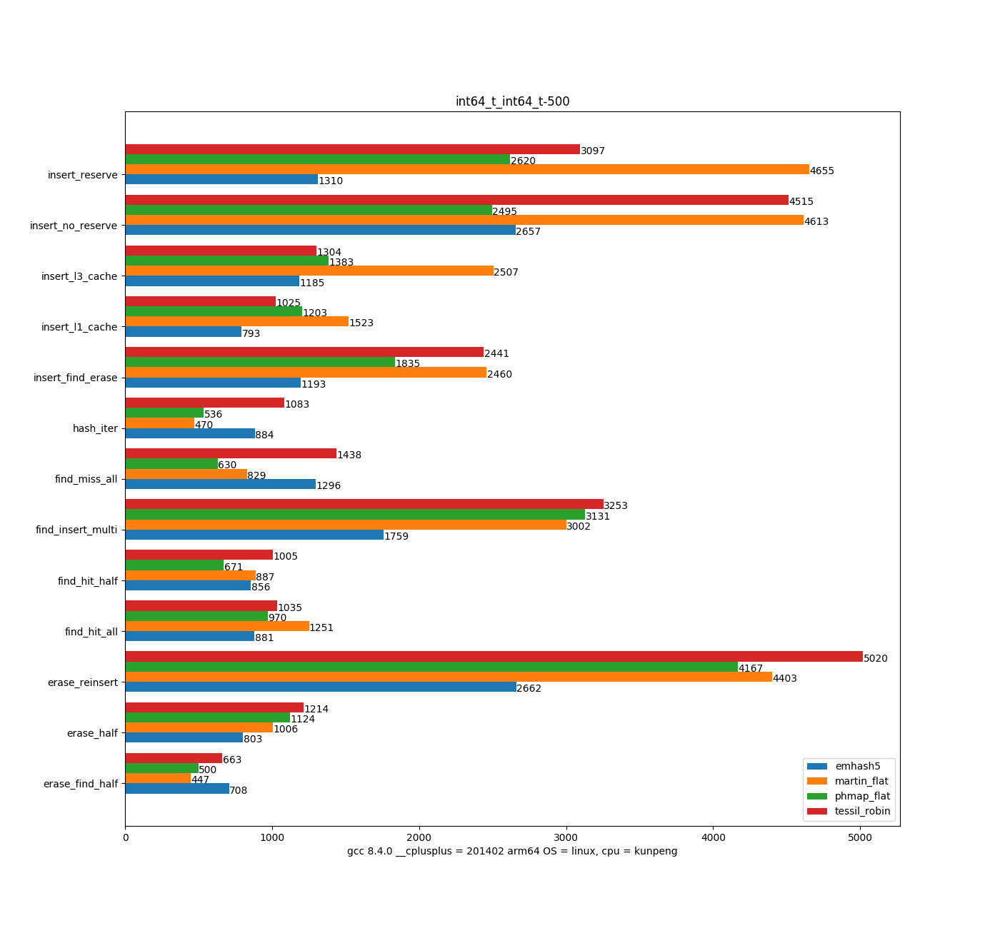
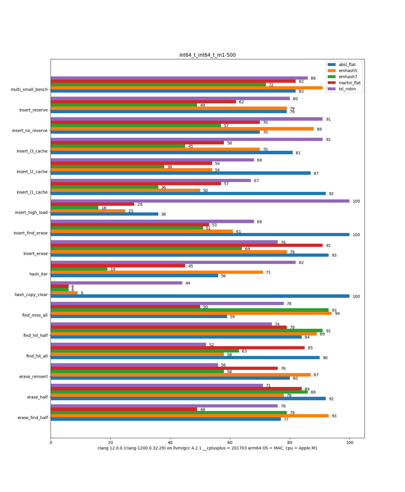
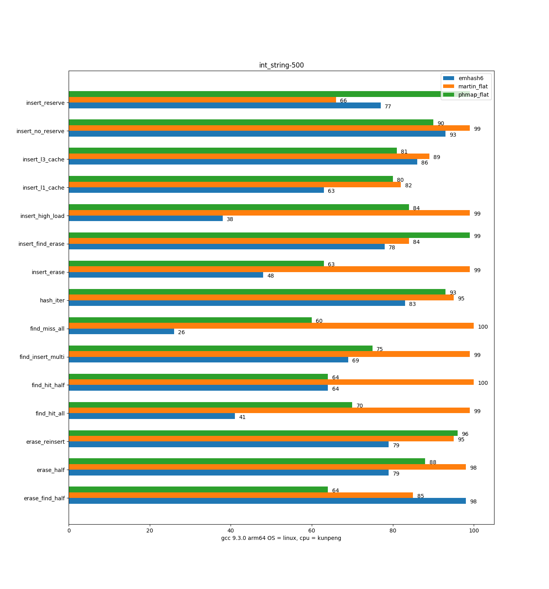
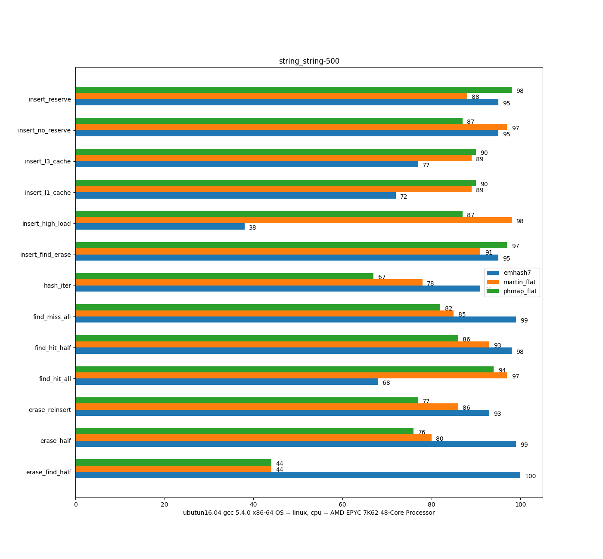
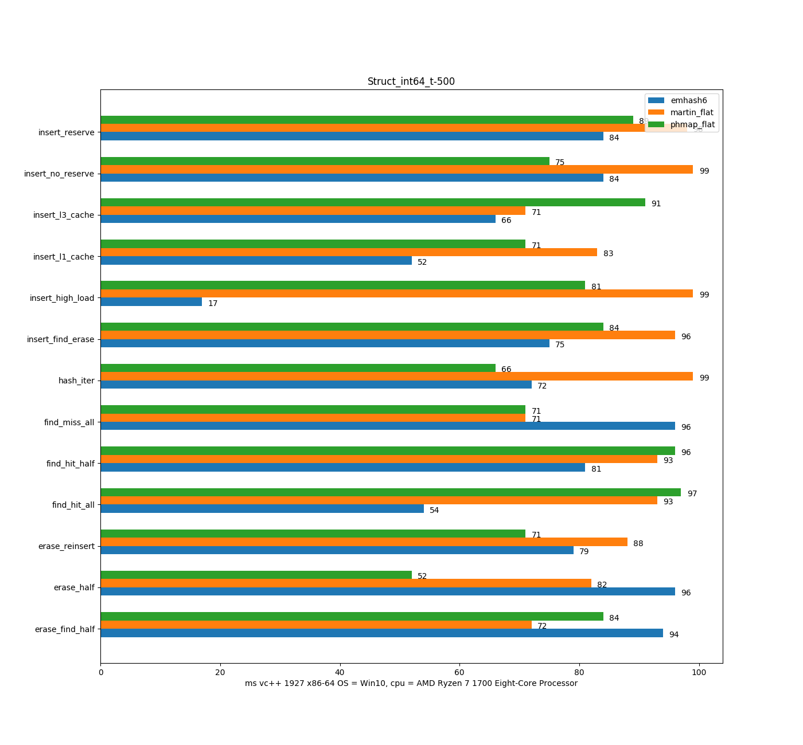
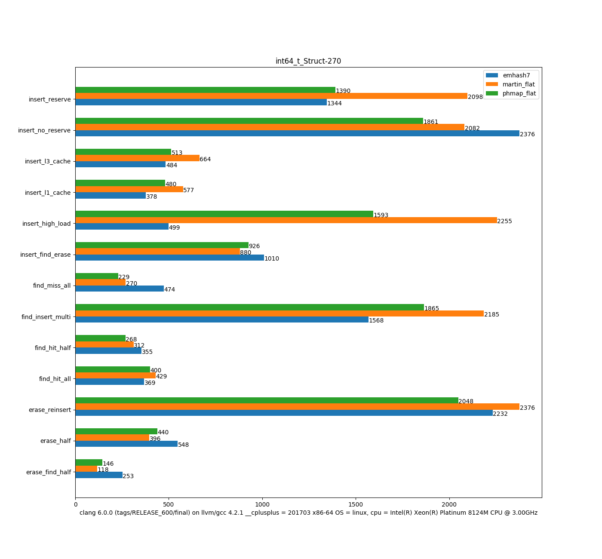
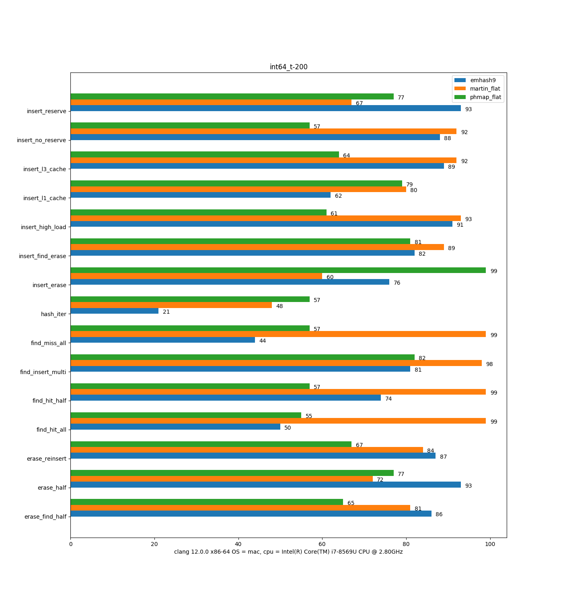

# emhash - Fast and memory efficient open addressing C++ flat hash table & hash map

> [!NOTE]
> Some features are not enabled by default; they can be enabled through defining macros. Some features may conflict with each other or are difficult to distribute in one header file, so they are distributed in a different file. Not all features are available in one file.


_Third-party bechmarks from <https://martin.ankerl.com/2022/08/27/hashmap-bench-01/> and <https://jacksonallan.github.io/c_cpp_hash_tables_benchmark/>._


- **Load factor** can be set to `0.999` by setting `EMHASH_HIGH_LOAD = <some value>` (in `hash_table[5-8].hpp`).
- **Header only** support with C++11/14/17/20
- Interface is highly compatible with `std::unordered_map`, with some new functions added for performance.
    - `_erase`: return void after erasing
    - `shrink_to_fit`: shrink to fit data for memory saving
    - `insert_unique`: insert unique key without finding
    - `try_find`: return value
    - `set_get`: find/insert combined
- **More efficient** than many hash map implementations when key/values are not aligned.
    - When `sizeof(key) % 8 != sizeof(value) % 8`
    - e.g., `hash_map<uint64_t, uint32_t>` can save 1/3 memory compared to `hash_map<uint64_t, uint64_t>`
- **LRU mode**: when `EMHASH_LRU_SET` is set, some keys will be marked as frequently accessed; if they are not in the main bucket slot, it will be swapped into it and probed once.
- **No tombstones**: performance will not deteriorate even with frequent insert/erase operations.
- **Fine-tuned implementations**: 4 different implementations, each with a different focus.
    - Some are focused on hot value optimization, some on cold (miss) optimization, some on insert/erase performance, etc.
- **Fully tested** on Windows, Linux, and Mac on AMD, Intel, and ARM64 processors, using MSVC, clang, and gcc.
- **Extensive optimizations for integer keys**

## Design

- **Single array & inline entries**: Each node/entry consists of a struct:
  ```cpp
  struct { Key key, size_t bucket, Value value };
  ```
  This design minimizes separate memory footprint.
- **Main bucket mapping**: The primary bucket is always assigned to `key_hash(key) % size` and cannot be occupied (unlike cuckoo hashing). Many operations begin their search from this bucket.
- **Smart collision resolution**: Collisions are resolved using a linked bucket approach, similar to separate chaining. This prevents severe performance degradation due to primary and secondary clustering.
- **Three-way combined probing strategy** for searching empty slots:
  - **Linear probing** scans 2-3 CPU cache lines.
  - **Quadratic probing** kicks in after limited linear probing.
  - **Bidirectional linear search** begins at both ends using the last found empty slot.
- **Optimized linear probing** (in `hash_table5.hpp`):
  Traditional linear probing becomes inefficient at high load factors. The new 3-way linear probing strategy significantly improves search performance. Even with a **load factor > 0.9**, benchmarks show it is **2-3 times faster** than conventional search strategies.
- **Secondary/backup hashing function**:
  If the input hash has a high collision rate, setting the `EMHASH_SAFE_HASH` macro enables a backup hashing function, defending against hash attacks (with a **10% performance trade-off**).
- **Collision statistics dump**:
  Analyze cache performance by dumping collision data, showing the number of probes required for successful/unsuccessful lookups.
- **Efficient batch lookup**:
  Uses x86 bit scan instructions (`ctz`) to scan **64 slots** at once.
- **Customizable hash functions**:
  Choose different hash algorithms by defining `EMHASH_FIBONACCI_HASH` or `EMHASH_IDENTITY_HASH` based on the use case.
- **Optimized string hashing**:
  Uses the third-party [wyhash](https://github.com/wangyi-fudan/wyhash) algorithm for string keys, which is significantly faster than `std::hash`.


## Example Usage of emhash

### Basic Usage
```cpp
// Constructor
emhash5::HashMap<int, int> m1(4);
m1.reserve(100);

for (int i = 1; i < 100; i++)
    m1.emplace_unique(i, i); // Key must be unique; better performance than emplace() or operator[].

auto no_value = m1.at(0); // Returns 0 if key is not found (no exception thrown).
```

### List Initialization
```cpp
emhash5::HashMap<int, std::string> m2 = {
    {1, "foo"},
    {3, "bar"},
    {2, "baz"},
};

// Try-get method (returns nullptr if the key does not exist)
auto* pvalue = m2.try_get(1);

// Try-set method (sets the key only if it does not exist)
if (m2.try_set(4, "for"))   printf("Set success\n");
if (!m2.try_set(1, "new"))  printf("Set failed\n");

// set_get method (returns old value while updating to new)
std::string ovalue = m2.set_get(1, "new"); // ovalue = "foo", now m2[1] = "new"

// Iterating through the map
for (auto& p : m2)
    std::cout << " " << p.first << " => " << p.second << '\n';
```

### Copy and Move Constructors
```cpp
// Copy constructor
emhash5::HashMap<int, std::string> m3 = m2;

// Move constructor
emhash5::HashMap<int, std::string> m4 = std::move(m2);
```

### Insertion Methods
```cpp
m2.insert_unique(4, "four");   // Insert only if key doesn't exist
m2[4] = "four_again";          // Overwrites existing value
m2.emplace(std::make_pair(4, "four"));
m2.insert({{6, "six"}, {5, "five"}});
```

### Range Constructor
```cpp
std::vector<std::pair<std::bitset<8>, int>> v = { {0x12, 1}, {0x01,-1} };
emhash5::HashMap<std::bitset<8>, double> m5(v.begin(), v.end());
```

### Custom Key Type (Option 1: Using Hash and Equality Comparators)
```cpp
// Define KeyHash and KeyEqual structs and use them in the template
emhash8::HashMap<Key, std::string, YourKeyHash, YourKeyEqual> m6 = {
    { {"John", "Doe"}, "example"},
    { {"Mary", "Sue"}, "another"}
};
```

### Custom Key Type (Option 2: Specializing std::hash)
```cpp
// Define a const == operator in your class/struct and specialize std::hash
emhash7::HashMap<Foo, std::string> m7 = {
    { Foo(1), "One"}, { Foo(2), "Two"}, { Foo(3), "Three"}
};
```

### C++20 Support (Using Lambda for Hashing and Comparison)
```cpp
#if CXX20
struct Goo { int val; };
auto hash = [](const Goo &g) { return std::hash<int>{}(g.val); };
auto comp = [](const Goo &l, const Goo &r) { return l.val == r.val; };

emhash5::HashMap<Goo, double, decltype(hash), decltype(comp)> m8;
#endif
```

### Efficient Iteration
```cpp
emhash8::HashMap<int, char> m8 = {{1, 'a'}, {2, 'b'}};
emhash7::HashMap<int, char> m7 = {{1, 'a'}, {2, 'b'}};

// Structured binding for iteration
for (const auto [k, v] : m8)
    printf("%d %c\n", k, v);

for (const auto [value, _, key] : m7)
    printf("%d %c\n", key, value); //different from the other hash map


// Accessing values in insertion order
const auto* data = m8.values();
for (int i = 0; i < m8.size(); i++)
    printf("%d %c\n", data[i].first, data[i].second);
```

## _Exceptional_ Performance

The benchmark results demonstrate that emhash delivers exceptional performance, even when performing insert and erase operations at an extremely high load factor of 0.999.

```cpp
static void RunHighLoadFactor()
{
    std::random_device rd;
    const auto rand_key = rd();
#if 1
    WyRand srngi(rand_key), srnge(rand_key);
#else
    std::mt19937_64 srngi(rand_key), srnge(rand_key);
#endif

    const auto max_lf   = 0.999f; //<= 0.9999f
    const auto vsize    = 1u << (20 + rand_key % 6);//must be power of 2
    emhash7::HashMap<int64_t, int> myhash(vsize, max_lf);

    auto nowus = getus();
    for (size_t i = 0; i < size_t(vsize * max_lf); i++)
        myhash.emplace(srngi(), i);
    assert(myhash.bucket_count() == vsize); //no rehash

    const auto insert_time = getus() - nowus; nowus = getus();
    //erase & insert at a fixed load factor
    for (size_t i = 0; i < vsize; i++) {
        myhash.erase(srnge()); //erase an old key
        myhash[srngi()] = 1;   //insert a new key
    }
    const auto erase_time = getus() - nowus;
    printf("vsize = %d, load factor = %.4f, insert/erase = %ld/%ld ms\n",
        vsize, myhash.load_factor(), insert_time / 1000, erase_time / 1000);
    assert(myhash.load_factor() >= max_lf - 0.001);
}
```
```
  vsize = 1048576, load factor = 0.9990, insert/erase = 25/76 ms
  vsize = 2097152, load factor = 0.9990, insert/erase = 52/222 ms
  vsize = 4194304, load factor = 0.9990, insert/erase = 117/450 ms
  vsize = 8388608, load factor = 0.9990, insert/erase = 251/1009 ms
```

## Benchmark Results

Some benchmark results have been uploaded, using various hash map implementations (`martinus`, `ska`, `phmap`, `dense_hash_map`, etc.) compiled and tested.

- **Benchmark Code:**
  - [Bench All](https://github.com/ktprime/emhash/blob/master/bench/em_bench.cpp)
  - [Bench High Load](https://github.com/ktprime/emhash/blob/master/bench/martin_bench.cpp)

- **Interactive Benchmark Results:**
  - **[Charts with Performance Curves](https://github.com/ktprime/emhash/blob/master/bench/tsl_bench/chartsAll.html)**
    *(Download all JavaScript files from the `tsl_bench` directory to view properly.)*
    Generated using the [Tessil Benchmark Code](https://tessil.github.io/2016/08/29/benchmark-hopscotch-map.html).

- **Raw Benchmark Data:**
  - [martin_bench.txt](https://github.com/ktprime/emhash/blob/master/bench/martin_bench.txt)
    *(Generated using [martinus/map_benchmark](https://github.com/martinus/map_benchmark))*.

The benchmark code has been slightly modified to accommodate additional hash maps. The results are **not absolute** as they depend on OS, CPU, compiler, and dataset input.

### Tested Environments
Benchmarks were performed on:
- **3 Linux servers** (AMD, Intel, ARM64)
- **Windows 10** PC & laptop
- **Apple M1**

#### Performance Comparison (Lower is Better)








---

## Limitations & Known Issues

### 1. Not a Node-Based Hash Map
`emhash` does **not** maintain reference stability during insert/erase/rehash operations. If stability is required, use a pointer-based approach or choose a node-based hash map.

**Incorrect usage example:**
```cpp
emhash7::HashMap<int, int> myhash(10);
myhash[1] = 1;
auto& myref = myhash[1]; // ❌ Reference is unstable

auto old = myref;  // ❌ `myref` may become invalid after rehash
```

**Potential crash scenario (rehash during insertion):**
```cpp
emhash7::HashMap<int, int> myhash2;
for (int i = 0; i < 10000; i++)
    myhash2[rand()] = myhash2[rand()]; // ❌ May crash due to rehashing

// ✅ Use `reserve()` before inserting large amounts of data:
myhash2.reserve(20000);
```

---

### 2. Handling Large Key-Value Pairs
For very large values (e.g., `sizeof(value) > 100 bytes`), **using pointers instead of direct values** can help reduce memory overhead.

**Memory-intensive approach:**
```cpp
emhash7::HashMap<keyT, valueT> myhash; // `valueT` is large (e.g., 100 bytes)
```

**Optimized memory usage:**
```cpp
emhash7::HashMap<keyT, valueT*> myhash2; // Use pointer
```
or
```cpp
emhash7::HashMap<keyT, std::shared_ptr<valueT>> myhash3;
```

---

### 3. Known Bug: Erasing During Iteration
If a key/iterator is erased during iteration, one key may be iterated **twice or missed**. Fixing this issue reduces performance by **20% or more**, and there is currently no efficient fix.

**Incorrect (may cause iteration issues):**
```cpp
emhash7::HashMap<int, int> myhash;
for (const auto& it : myhash) {
    if (some_key == it.first) {
        myhash.erase(some_key); // ❌ No break after erase
    }
    do_some_more();
}
```

**Corrected version (use iterator-based erase):**
```cpp
for (auto it = myhash.begin(); it != myhash.end();) {
    if (some_key == it->first) {
        it = myhash.erase(it); // ✅ Correct: assign back to iterator
    } else {
        ++it;
    }
    do_some_more();
}
```

**Another common mistake (invalid iterator use after erase):**
```cpp
emhash7::HashMap<int, int> myhash = {{1, 2}, {5, 2}};
auto it = myhash.find(1);

it = myhash.erase(it);  // ✅ Correct
myhash.erase(it++);     // ❌ Error: `it` is already erased
```

---

## Which Hash Map Should You Choose?
The best choice depends on your use case. Here are some general recommendations:

1. **For complex/big keys & values (e.g., `std::string` or user-defined structs)**
   - **Use `emhash8`**
   - Benefits:
     - Memory layout is contiguous (like `std::vector`), resulting in **fast iteration speed**.
     - **Fast search & insertion**, **low memory usage**.
   - Drawback:
     - Slightly slower deletion compared to `emhash5-7`.

2. **For insertion-heavy workloads**
   - **Use `emhash7`**
   - Benefits:
     - Supports an **extremely high load factor** (`>0.90`, even `0.99`).
     - **Efficient memory usage**.

3. **For fast search & erasure with integer keys**
   - **Use `emhash5/6`**
   - Benefits:
     - Optimized for **find-hit** and **erasure** with integer keys.
     - Can be used as a **small stack hashmap** by defining `EMH_SMALL_SIZE`.

---

## Benchmark Environment
The following benchmarks were performed on an **AMD 5800H CPU (Windows 10, GCC 11.3)** using:
[Benchmark Code](https://github.com/ktprime/emhash/blob/master/bench/qbench.cpp)

---


|10       hashmap|Insert|Fhit |Fmiss|Erase|Iter |LoadFactor|
|----------------|------|-----|-----|-----|-----|----------|
|emilib2::HashMap|  32.6| 26.0| 27.7| 35.6| 23.8| 62.5     |
|emhash8::HashMap|  46.5| 27.5| 29.5| 29.2| 23.2| 62.5     |
|emhash7::HashMap|  38.0| 27.6| 29.1| 27.9| 23.9| 62.5     |
|emhash6::HashMap|  38.9| 27.2| 28.8| 28.1| 23.9| 62.5     |
|emhash5::HashMap|  41.3| 27.2| 28.2| 27.8| 28.7| 62.5     |


|200      hashmap|Insert|Fhit |Fmiss|Erase|Iter |LoadFactor|
|----------------|------|-----|-----|-----|-----|----------|
|emilib2::HashMap|  12.4| 3.19| 7.64| 9.56| 2.39| 78.1     |
|emhash8::HashMap|  15.0| 5.14| 6.40| 7.22| 1.17| 78.1     |
|emhash7::HashMap|  12.4| 5.09| 5.92| 4.95| 1.88| 78.1     |
|emhash6::HashMap|  12.8| 4.96| 6.77| 5.67| 1.89| 78.1     |
|emhash5::HashMap|  15.8| 4.88| 5.79| 5.43| 3.54| 78.1     |


|3000     hashmap|Insert|Fhit |Fmiss|Erase|Iter |LoadFactor|
|----------------|------|-----|-----|-----|-----|----------|
|emilib2::HashMap|  9.67| 1.90| 4.98| 7.16| 1.33| 73.2     |
|emhash8::HashMap|  13.5| 4.00| 5.38| 6.21| 0.08| 73.2     |
|emhash7::HashMap|  10.6| 3.98| 4.88| 3.93| 0.76| 73.2     |
|emhash6::HashMap|  11.4| 3.81| 5.70| 4.78| 0.76| 73.2     |
|emhash5::HashMap|  14.3| 3.82| 4.80| 4.50| 2.94| 73.2     |


|40000    hashmap|Insert|Fhit |Fmiss|Erase|Iter |LoadFactor|
|----------------|------|-----|-----|-----|-----|----------|
|emilib2::HashMap|  10.7| 2.82| 2.85| 8.47| 1.43| 61.0     |
|emhash8::HashMap|  16.0| 4.22| 6.01| 7.14| 0.00| 61.0     |
|emhash7::HashMap|  11.7| 4.19| 5.47| 4.44| 0.73| 61.0     |
|emhash6::HashMap|  13.0| 3.89| 5.86| 5.24| 0.73| 61.0     |
|emhash5::HashMap|  15.7| 3.93| 5.30| 5.01| 4.40| 61.0     |


|500000   hashmap|Insert|Fhit |Fmiss|Erase|Iter |LoadFactor|
|----------------|------|-----|-----|-----|-----|----------|
|emilib2::HashMap|  20.0| 13.3| 3.99| 17.9| 1.58| 47.7     |
|emhash8::HashMap|  26.2| 6.39| 7.62| 9.17| 0.00| 47.7     |
|emhash7::HashMap|  18.3| 10.6| 7.79| 9.82| 0.78| 47.7     |
|emhash6::HashMap|  21.6| 8.74| 8.39| 9.82| 0.79| 47.7     |
|emhash5::HashMap|  24.5| 8.19| 9.93| 8.93| 6.16| 47.7     |


|7200000  hashmap|Insert|Fhit |Fmiss|Erase|Iter |LoadFactor|
|----------------|------|-----|-----|-----|-----|----------|
|emilib2::HashMap|  50.3| 21.3| 24.8| 29.6| 0.97| 85.8     |
|emhash8::HashMap|  82.4| 18.5| 18.7| 39.2| 0.00| 85.8     |
|emhash7::HashMap|  51.2| 18.4| 21.1| 20.2| 0.63| 85.8     |
|emhash6::HashMap|  53.5| 16.7| 19.2| 26.0| 0.63| 85.8     |
|emhash5::HashMap|  62.6| 16.0| 19.7| 22.6| 1.60| 85.8     |


|10000000 hashmap|Insert|Fhit |Fmiss|Erase|Iter |LoadFactor|
|----------------|------|-----|-----|-----|-----|----------|
|emilib2::HashMap|  79.4| 32.3| 17.7| 48.0| 1.45| 59.6     |
|emhash8::HashMap|  95.6| 18.3| 18.1| 46.3| 0.00| 59.6     |
|emhash7::HashMap|  66.0| 16.9| 18.1| 20.4| 0.74| 59.6     |
|emhash6::HashMap|  63.6| 15.1| 17.0| 24.0| 0.75| 59.6     |
|emhash5::HashMap|  64.7| 16.6| 18.8| 22.3| 4.75| 59.6     |


|50000000 hashmap|Insert|Fhit |Fmiss|Erase|Iter |LoadFactor|
|----------------|------|-----|-----|-----|-----|----------|
|emilib2::HashMap|  79.4| 31.2| 27.7| 55.1| 1.22| 74.5     |
|emhash8::HashMap|  93.1| 19.4| 20.1| 41.7| 0.00| 74.5     |
|emhash7::HashMap|  62.7| 20.3| 22.4| 25.2| 0.68| 74.5     |
|emhash6::HashMap|  61.5| 16.1| 18.0| 28.0| 0.67| 74.5     |
|emhash5::HashMap|  65.1| 16.1| 18.8| 24.3| 2.72| 74.5     |

